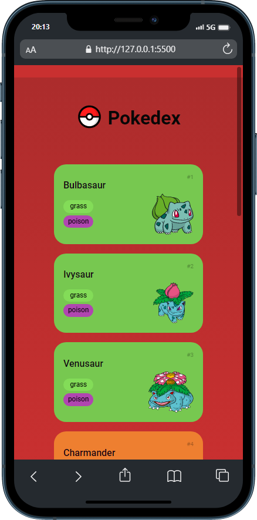
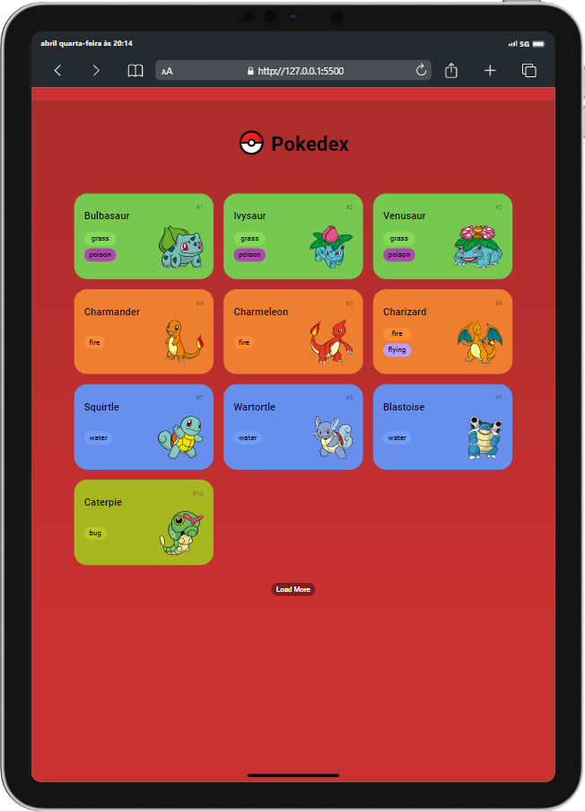

<h1 align="center">
     Pokedex
</h1>

<h3 align="center">
🏮 Preview - Mobile e Tablet
</h3>
 

&ensp; &ensp; &ensp; &ensp; &ensp; &ensp; &ensp; &ensp; &ensp; &ensp; &ensp; &ensp; &ensp; &ensp;  &ensp; &ensp; &ensp; 
 
 

## 🕹 Sobre

> É um projeto 100% responsivo onde desenvolvi uma listagem de pokémon integrada com a PokeAPI, foi minha primeira vez utilizando uma API, aprendi muitos conceitos durante o processo, como: a procurar e utilizar os elementos da documentação corretamente, fazer uma requisição HTTP, utilizar os métodos de array do javascript, entre outras coisas. 

 

## 💮 Tecnologias utilizadas:

Para o desenvolvimento deste site utilizei as seguintes tecnologias:

* HTML
* CSS
* JavaScript
* PokeAPI

---

## 🎐 Licença
Esse projeto está sob licença. Clique no arquivo [LICENÇA](https://github.com/larisn/larisn/blob/main/LICENSE2.md) para ver mais detalhes.

 

---

Feito com ❤️ by larisn
